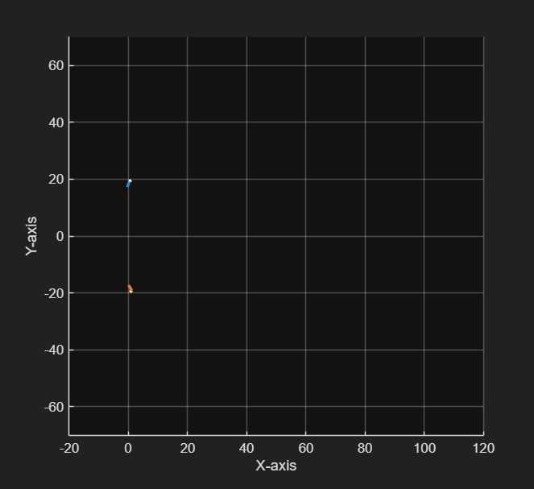

# Bayesian Recursive Estimation Workspace
----------------------------------------

A custom MATLAB package for target tracking applications. 

This package holds general dynamics models, different distributions, and filters that work together. 

NOTE: This code is still in development and is in no way promised to perform to any specific standard. 

## Example 1: 
Gamma Gaussian Inverse Wishart applied to PHD filter for simulated measurements using the GGIW Mixture model. Output of test_PHD_GGIW.m. 

## Example 2: 
Trajectory Set Theory GM-PHD filter implemented as an alternative to labeled RFS. Output of test_trajectory_gm_phd.m. 

You can see the L-scan window in red, and previous target trajectories in the other colors. The L-scan is performed as an efficient implementation of the trajectory set theory filters. 

