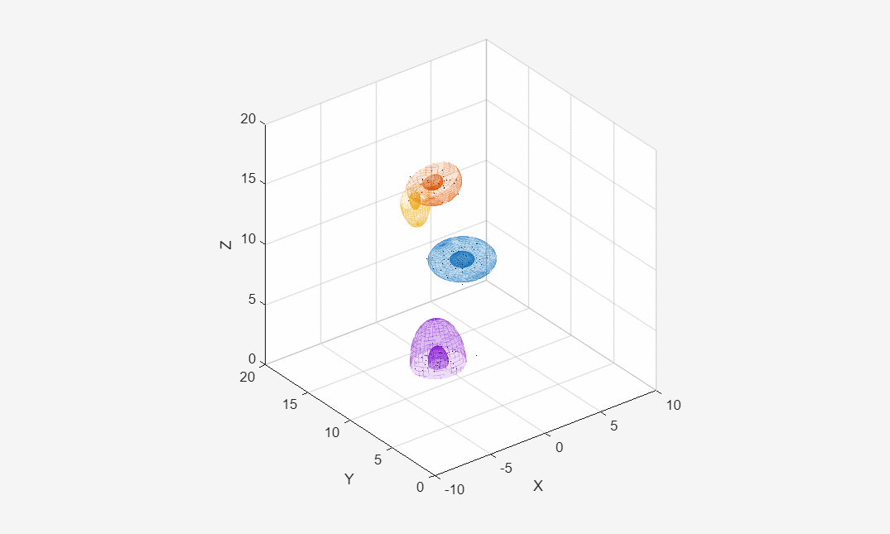

# Bayesian Recursive Estimation Workspace
----------------------------------------

A custom MATLAB package for navigation and target tracking applications. 

This package holds general dynamics models, different distributions, and filters that work together. 

NOTE: This code is still in development and is in no way promised to perform to any specific standard. 

## Example: 
Gamma Gaussian Inverse Wishart applied to PHD filter for simulated measurements using the GGIW Mixture model. 

