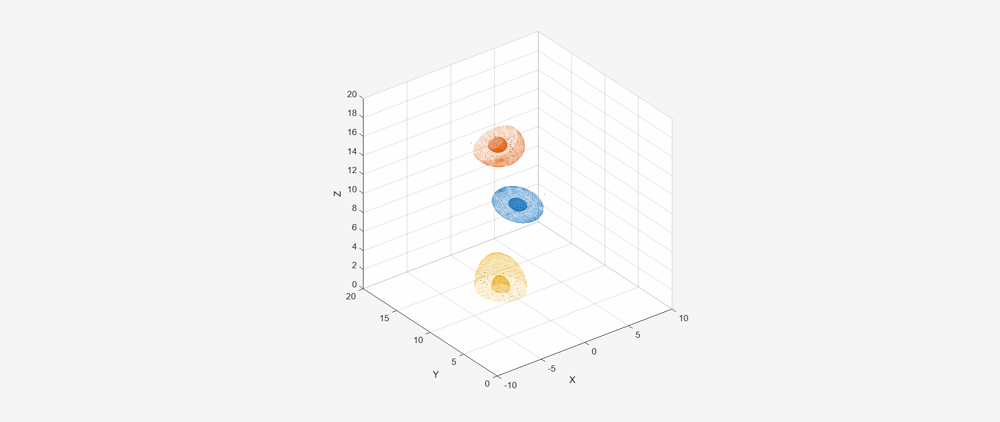
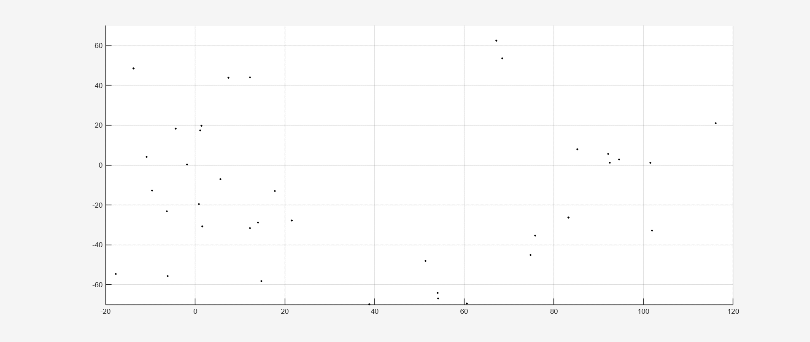
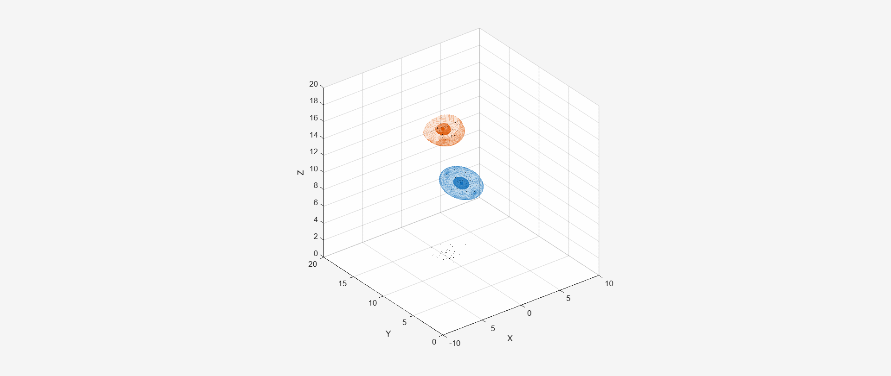

# Bayesian Recursive Estimation Workspace in MATLAB
----------------------------------------

A MATLAB wrapper for target tracking applications using [BREW](https://github.com/Dawson-Pierce/brew). 

This package holds general dynamics models, different distributions, and filters that work together. 

NOTE: This code is still in development and is in no way promised to perform to any specific standard. 

## Getting Started:

To get started, run the function

```
build_brew_mex()
```

After the compile is done, the wrapper should work as intended. 

## Example 1: 
Gamma Gaussian Inverse Wishart applied to PHD filter for simulated measurements using the GGIW Mixture model. Output of test_PHD_GGIW.m. 



## Example 2: 
Trajectory Set Theory GM-PHD filter implemented as an alternative to labeled RFS. Output of test_trajectory_gm_phd.m. 

You can see the L-scan window in red, and previous target trajectories in the other colors. The L-scan is performed as an efficient implementation of the trajectory set theory filters. 



## Example 3: 
Same test as Example 1, but with the TST-GGIW. Output of test_PHD_TrajectoryGGIW.m. 


